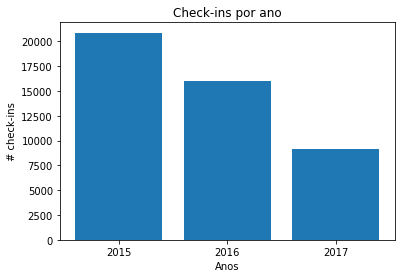

# Análise de Dados de Manaus com Foursquare

Este Trabalho tem o objetivo de analisar dados da cidade de Manaus-AM obtidos na rede social Foursquare nos anos de 2015,2016 e 2017, e assim responder as seguintes questões:
- Quantos Check-ins ocorreram nesse período?
- Em quantos locais distintos foram realizados esses Check-ins?
- Como estão distribuídos esses Check-ins pela cidade?
- A quais categorias esses Check-ins pertencem?
- Quais são as Subcategorias
- Quais os locais mais bem avaliados da cidade?
- Quais são os lugares mais frequenados de Manaus?

## Bibliotecas


```python
import gmplot #google maps plot
import pandas as pd
import matplotlib.pyplot as plt #ferramenta para plot

% matplotlib inline
```

## Carregando bases de Dados


```python
mao_2015_df = pd.read_csv('Data/Foursquare_MAO_MAR_2015', encoding = 'utf-8')
mao_2016_df = pd.read_csv('Data/Foursquare_MAO_MAR_2016', encoding = 'utf-8')
mao_2017_df = pd.read_csv('Data/Foursquare_MAO_MAR_2017', encoding = 'utf-8')
```


```python
frames = [mao_2015_df, mao_2016_df, mao_2017_df]
mao_df = pd.concat(frames) #dataset com os anos de 2015, 2016 e 2017
mao_df
```


<div>
<style scoped>
    .dataframe tbody tr th:only-of-type {
        vertical-align: middle;
    }

    .dataframe tbody tr th {
        vertical-align: top;
    }

    .dataframe thead th {
        text-align: right;
    }
</style>
<table border="1" class="dataframe">
  <thead>
    <tr style="text-align: right;">
      <th></th>
      <th>CREATED AT</th>
      <th>TIME ZONE OFFSET</th>
      <th>USER GENDER</th>
      <th>VENUE ID</th>
      <th>VENUE LATITUDE</th>
      <th>VENUE LONGITUDE</th>
      <th>CITY</th>
      <th>COUNTRY</th>
      <th>VENUE MACRO-CATEGORY ID</th>
      <th>VENUE MACRO-CATEGORY NAME</th>
      <th>VENUE CATEGORY ID</th>
      <th>VENUE CATEGORY NAME</th>
      <th>CHECK-INS COUNT</th>
      <th>VENUE LIKES</th>
      <th>VENUE RATING</th>
    </tr>
  </thead>
  <tbody>
    <tr>
      <th>0</th>
      <td>1425168058</td>
      <td>-240</td>
      <td>female</td>
      <td>4b535772f964a520249827e3</td>
      <td>-3.104187</td>
      <td>-60.011926</td>
      <td>Manaus</td>
      <td>Brazil</td>
      <td>4d4b7105d754a06378d81259</td>
      <td>Shop &amp; Service</td>
      <td>4bf58dd8d48988d1fd941735</td>
      <td>Shopping Mall</td>
      <td>258789</td>
      <td>4111</td>
      <td>9.0</td>
    </tr>
    <tr>
      <th>1</th>
      <td>1425168234</td>
      <td>-240</td>
      <td>female</td>
      <td>54b06ea9498e668872a79d7b</td>
      <td>-3.101788</td>
      <td>-60.017451</td>
      <td>Manaus</td>
      <td>Brazil</td>
      <td>4d4b7105d754a06374d81259</td>
      <td>Food</td>
      <td>4bf58dd8d48988d16c941735</td>
      <td>Burger Joint</td>
      <td>439</td>
      <td>31</td>
      <td>7.3</td>
    </tr>
    <tr>
      <th>2</th>
      <td>1425168242</td>
      <td>-240</td>
      <td>female</td>
      <td>54580412498e633d7f5188af</td>
      <td>-3.108907</td>
      <td>-60.019625</td>
      <td>Manaus</td>
      <td>Brazil</td>
      <td>4d4b7105d754a06378d81259</td>
      <td>Shop &amp; Service</td>
      <td>4bf58dd8d48988d104951735</td>
      <td>Boutique</td>
      <td>42</td>
      <td>1</td>
      <td>none</td>
    </tr>
    <tr>
      <th>3</th>
      <td>1425168257</td>
      <td>-240</td>
      <td>male</td>
      <td>4ecc3b8161af1f8ac32f354a</td>
      <td>-3.088108</td>
      <td>-60.062357</td>
      <td>Manaus</td>
      <td>Brazil</td>
      <td>4d4b7105d754a06375d81259</td>
      <td>Professional &amp; Other Places</td>
      <td>4bf58dd8d48988d132941735</td>
      <td>Church</td>
      <td>6967</td>
      <td>95</td>
      <td>none</td>
    </tr>
    <tr>
      <th>4</th>
      <td>1425168263</td>
      <td>-240</td>
      <td>female</td>
      <td>4b535772f964a520249827e3</td>
      <td>-3.104187</td>
      <td>-60.011926</td>
      <td>Manaus</td>
      <td>Brazil</td>
      <td>4d4b7105d754a06378d81259</td>
      <td>Shop &amp; Service</td>
      <td>4bf58dd8d48988d1fd941735</td>
      <td>Shopping Mall</td>
      <td>258789</td>
      <td>4111</td>
      <td>9.0</td>
    </tr>
    <tr>
      <th>5</th>
      <td>1425168344</td>
      <td>-240</td>
      <td>male</td>
      <td>52bba79e498e5d69657ae557</td>
      <td>-3.124695</td>
      <td>-60.008604</td>
      <td>none</td>
      <td>Brazil</td>
      <td>4e67e38e036454776db1fb3a</td>
      <td>Residence</td>
      <td>4bf58dd8d48988d103941735</td>
      <td>Home (private)</td>
      <td>743</td>
      <td>0</td>
      <td>none</td>
    </tr>
    <tr>
      <th>6</th>
      <td>1425168453</td>
      <td>-240</td>
      <td>none</td>
      <td>53658b00498ee61c4d6f5ad5</td>
      <td>-3.058496</td>
      <td>-60.044966</td>
      <td>none</td>
      <td>Brazil</td>
      <td>4d4b7105d754a06374d81259</td>
      <td>Food</td>
      <td>4bf58dd8d48988d1ca941735</td>
      <td>Pizza Place</td>
      <td>52</td>
      <td>2</td>
      <td>none</td>
    </tr>
    <tr>
      <th>7</th>
      <td>1425168607</td>
      <td>-240</td>
      <td>female</td>
      <td>4c2d2f35e307d13ad7710dda</td>
      <td>-3.105087</td>
      <td>-60.010712</td>
      <td>Manaus</td>
      <td>Brazil</td>
      <td>4d4b7105d754a06378d81259</td>
      <td>Shop &amp; Service</td>
      <td>52f2ab2ebcbc57f1066b8b42</td>
      <td>Big Box Store</td>
      <td>15493</td>
      <td>309</td>
      <td>6.0</td>
    </tr>
    <tr>
      <th>8</th>
      <td>1425168697</td>
      <td>-240</td>
      <td>female</td>
      <td>4bb7be58314e95211ca2479d</td>
      <td>-3.130264</td>
      <td>-60.023149</td>
      <td>Manaus</td>
      <td>Brazil</td>
      <td>4d4b7104d754a06370d81259</td>
      <td>Arts &amp; Entertainment</td>
      <td>4bf58dd8d48988d137941735</td>
      <td>Theater</td>
      <td>23260</td>
      <td>1289</td>
      <td>9.5</td>
    </tr>
    <tr>
      <th>9</th>
      <td>1425168876</td>
      <td>-240</td>
      <td>male</td>
      <td>501c154ce4b01e9e71ba350e</td>
      <td>-3.078257</td>
      <td>-60.010819</td>
      <td>Manaus</td>
      <td>Brazil</td>
      <td>4d4b7105d754a06374d81259</td>
      <td>Food</td>
      <td>5294c7523cf9994f4e043a62</td>
      <td>Acai House</td>
      <td>12</td>
      <td>0</td>
      <td>none</td>
    </tr>
    <tr>
      <th>10</th>
      <td>1425168921</td>
      <td>-240</td>
      <td>male</td>
      <td>511845cbe4b01271856cda47</td>
      <td>-3.000086</td>
      <td>-59.990707</td>
      <td>Manaus</td>
      <td>Brazil</td>
      <td>4d4b7105d754a06374d81259</td>
      <td>Food</td>
      <td>4bf58dd8d48988d1ca941735</td>
      <td>Pizza Place</td>
      <td>51</td>
      <td>0</td>
      <td>none</td>
    </tr>
    <tr>
      <th>11</th>
      <td>1425169091</td>
      <td>-240</td>
      <td>male</td>
      <td>4eb5ece4775b544c27885ebe</td>
      <td>-3.106641</td>
      <td>-60.033748</td>
      <td>Manaus</td>
      <td>Brazil</td>
      <td>4d4b7105d754a06374d81259</td>
      <td>Food</td>
      <td>4bf58dd8d48988d1c7941735</td>
      <td>Snack Place</td>
      <td>1500</td>
      <td>59</td>
      <td>5.8</td>
    </tr>
    <tr>
      <th>12</th>
      <td>1425169138</td>
      <td>-240</td>
      <td>female</td>
      <td>4c94113f38dd8cfa0cbfc562</td>
      <td>-3.063751</td>
      <td>-60.057423</td>
      <td>Manaus</td>
      <td>Brazil</td>
      <td>4d4b7105d754a06374d81259</td>
      <td>Food</td>
      <td>4bf58dd8d48988d111941735</td>
      <td>Japanese Restaurant</td>
      <td>42</td>
      <td>3</td>
      <td>none</td>
    </tr>
    <tr>
      <th>13</th>
      <td>1425169220</td>
      <td>-240</td>
      <td>female</td>
      <td>5334d143498e2f5d62956330</td>
      <td>-3.085441</td>
      <td>-60.025965</td>
      <td>Manaus</td>
      <td>Brazil</td>
      <td>4d4b7105d754a06374d81259</td>
      <td>Food</td>
      <td>4bf58dd8d48988d1d2941735</td>
      <td>Sushi Restaurant</td>
      <td>1511</td>
      <td>103</td>
      <td>8.1</td>
    </tr>
    <tr>
      <th>14</th>
      <td>1425169299</td>
      <td>-240</td>
      <td>female</td>
      <td>514fa86ee4b0a1834b768adc</td>
      <td>-3.107690</td>
      <td>-60.038509</td>
      <td>Manaus</td>
      <td>Brazil</td>
      <td>4d4b7105d754a06374d81259</td>
      <td>Food</td>
      <td>4bf58dd8d48988d1c7941735</td>
      <td>Snack Place</td>
      <td>936</td>
      <td>52</td>
      <td>8.5</td>
    </tr>
    <tr>
      <th>15</th>
      <td>1425169299</td>
      <td>-240</td>
      <td>male</td>
      <td>4f175676e4b0ba019490640a</td>
      <td>-3.065652</td>
      <td>-60.011539</td>
      <td>Manaus</td>
      <td>Brazil</td>
      <td>4d4b7105d754a06374d81259</td>
      <td>Food</td>
      <td>4bf58dd8d48988d1d0941735</td>
      <td>Dessert Shop</td>
      <td>713</td>
      <td>42</td>
      <td>7.1</td>
    </tr>
    <tr>
      <th>16</th>
      <td>1425169526</td>
      <td>-240</td>
      <td>female</td>
      <td>4f9b4fc8e4b02343c7aaa4e4</td>
      <td>-3.111125</td>
      <td>-60.007241</td>
      <td>none</td>
      <td>Brazil</td>
      <td>4d4b7105d754a06377d81259</td>
      <td>Outdoors &amp; Recreation</td>
      <td>4bf58dd8d48988d164941735</td>
      <td>Plaza</td>
      <td>1613</td>
      <td>6</td>
      <td>6.2</td>
    </tr>
    <tr>
      <th>17</th>
      <td>1425169545</td>
      <td>-240</td>
      <td>female</td>
      <td>53caf2c3498edc8c0e4aa44a</td>
      <td>-3.074036</td>
      <td>-60.031542</td>
      <td>Manaus</td>
      <td>Brazil</td>
      <td>4d4b7105d754a06374d81259</td>
      <td>Food</td>
      <td>4bf58dd8d48988d1d2941735</td>
      <td>Sushi Restaurant</td>
      <td>2655</td>
      <td>102</td>
      <td>8.2</td>
    </tr>
    <tr>
      <th>18</th>
      <td>1425169572</td>
      <td>-240</td>
      <td>male</td>
      <td>4ea4f8e98b81a02f8aa555d2</td>
      <td>-3.084998</td>
      <td>-60.072558</td>
      <td>Manaus</td>
      <td>Brazil</td>
      <td>4d4b7105d754a06378d81259</td>
      <td>Shop &amp; Service</td>
      <td>4bf58dd8d48988d1fd941735</td>
      <td>Shopping Mall</td>
      <td>51337</td>
      <td>1845</td>
      <td>8.5</td>
    </tr>
    <tr>
      <th>19</th>
      <td>1425169633</td>
      <td>-240</td>
      <td>female</td>
      <td>510bab01e4b0607cdd50cc94</td>
      <td>-3.115191</td>
      <td>-59.985483</td>
      <td>none</td>
      <td>Brazil</td>
      <td>4e67e38e036454776db1fb3a</td>
      <td>Residence</td>
      <td>4bf58dd8d48988d103941735</td>
      <td>Home (private)</td>
      <td>1137</td>
      <td>1</td>
      <td>none</td>
    </tr>
    <tr>
      <th>20</th>
      <td>1425169678</td>
      <td>-240</td>
      <td>male</td>
      <td>4e98d2d89a52ceeb87edc8bc</td>
      <td>-3.089944</td>
      <td>-60.020165</td>
      <td>none</td>
      <td>Brazil</td>
      <td>4e67e38e036454776db1fb3a</td>
      <td>Residence</td>
      <td>4bf58dd8d48988d103941735</td>
      <td>Home (private)</td>
      <td>1022</td>
      <td>2</td>
      <td>none</td>
    </tr>
    <tr>
      <th>21</th>
      <td>1425169711</td>
      <td>-240</td>
      <td>female</td>
      <td>4ef136595c5cfe0cf60d20af</td>
      <td>-3.122725</td>
      <td>-60.036923</td>
      <td>none</td>
      <td>Brazil</td>
      <td>4d4b7105d754a06374d81259</td>
      <td>Food</td>
      <td>4bf58dd8d48988d1ca941735</td>
      <td>Pizza Place</td>
      <td>641</td>
      <td>24</td>
      <td>7.4</td>
    </tr>
    <tr>
      <th>22</th>
      <td>1425169774</td>
      <td>-240</td>
      <td>male</td>
      <td>4f25ddb5e4b0b2f990ecaf24</td>
      <td>-3.105621</td>
      <td>-60.033477</td>
      <td>Manaus</td>
      <td>Brazil</td>
      <td>4d4b7105d754a06374d81259</td>
      <td>Food</td>
      <td>4bf58dd8d48988d1df931735</td>
      <td>BBQ Joint</td>
      <td>253</td>
      <td>7</td>
      <td>6.3</td>
    </tr>
    <tr>
      <th>23</th>
      <td>1425169844</td>
      <td>-240</td>
      <td>male</td>
      <td>515f823ae4b0a6b1b1245c26</td>
      <td>-3.115553</td>
      <td>-59.997043</td>
      <td>none</td>
      <td>Brazil</td>
      <td>4e67e38e036454776db1fb3a</td>
      <td>Residence</td>
      <td>4bf58dd8d48988d103941735</td>
      <td>Home (private)</td>
      <td>1078</td>
      <td>2</td>
      <td>none</td>
    </tr>
    <tr>
      <th>24</th>
      <td>1425169892</td>
      <td>-240</td>
      <td>female</td>
      <td>548b087f498ecccac94e5629</td>
      <td>-3.103290</td>
      <td>-60.024997</td>
      <td>Manaus</td>
      <td>Brazil</td>
      <td>4d4b7105d754a06378d81259</td>
      <td>Shop &amp; Service</td>
      <td>52f2ab2ebcbc57f1066b8b42</td>
      <td>Big Box Store</td>
      <td>7203</td>
      <td>382</td>
      <td>9.1</td>
    </tr>
    <tr>
      <th>25</th>
      <td>1425169977</td>
      <td>-240</td>
      <td>female</td>
      <td>4f21e37fe4b0717a65d20303</td>
      <td>-3.063914</td>
      <td>-60.101478</td>
      <td>Manaus</td>
      <td>Brazil</td>
      <td>4d4b7105d754a06377d81259</td>
      <td>Outdoors &amp; Recreation</td>
      <td>4bf58dd8d48988d1e2941735</td>
      <td>Beach</td>
      <td>20616</td>
      <td>682</td>
      <td>9.0</td>
    </tr>
    <tr>
      <th>26</th>
      <td>1425170218</td>
      <td>-240</td>
      <td>female</td>
      <td>4ea422facc2102b34db480ab</td>
      <td>-3.122000</td>
      <td>-60.013094</td>
      <td>Manaus</td>
      <td>Brazil</td>
      <td>4d4b7105d754a06377d81259</td>
      <td>Outdoors &amp; Recreation</td>
      <td>4f2a25ac4b909258e854f55f</td>
      <td>Neighborhood</td>
      <td>16588</td>
      <td>86</td>
      <td>none</td>
    </tr>
    <tr>
      <th>27</th>
      <td>1425170218</td>
      <td>-240</td>
      <td>male</td>
      <td>4bb7be58314e95211ca2479d</td>
      <td>-3.130264</td>
      <td>-60.023149</td>
      <td>Manaus</td>
      <td>Brazil</td>
      <td>4d4b7104d754a06370d81259</td>
      <td>Arts &amp; Entertainment</td>
      <td>4bf58dd8d48988d137941735</td>
      <td>Theater</td>
      <td>23260</td>
      <td>1289</td>
      <td>9.5</td>
    </tr>
    <tr>
      <th>28</th>
      <td>1425170256</td>
      <td>-240</td>
      <td>male</td>
      <td>5044b5f2e4b0f30043014d14</td>
      <td>-3.005597</td>
      <td>-59.977979</td>
      <td>Manaus</td>
      <td>Brazil</td>
      <td>4e67e38e036454776db1fb3a</td>
      <td>Residence</td>
      <td>4f2a210c4b9023bd5841ed28</td>
      <td>Housing Development</td>
      <td>7804</td>
      <td>52</td>
      <td>none</td>
    </tr>
    <tr>
      <th>29</th>
      <td>1425170442</td>
      <td>-240</td>
      <td>female</td>
      <td>53584318498e575268944d59</td>
      <td>-3.043967</td>
      <td>-59.950810</td>
      <td>Manaus</td>
      <td>Brazil</td>
      <td>4e67e38e036454776db1fb3a</td>
      <td>Residence</td>
      <td>4bf58dd8d48988d103941735</td>
      <td>Home (private)</td>
      <td>32</td>
      <td>0</td>
      <td>none</td>
    </tr>
    <tr>
      <th>...</th>
      <td>...</td>
      <td>...</td>
      <td>...</td>
      <td>...</td>
      <td>...</td>
      <td>...</td>
      <td>...</td>
      <td>...</td>
      <td>...</td>
      <td>...</td>
      <td>...</td>
      <td>...</td>
      <td>...</td>
      <td>...</td>
      <td>...</td>
    </tr>
    <tr>
      <th>9084</th>
      <td>1491000418</td>
      <td>-240</td>
      <td>male</td>
      <td>4b48d003f964a520245826e3</td>
      <td>-3.124665</td>
      <td>-60.043340</td>
      <td>Manaus</td>
      <td>Brazil</td>
      <td>4d4b7105d754a06377d81259</td>
      <td>Outdoors &amp; Recreation</td>
      <td>4bf58dd8d48988d1e0941735</td>
      <td>Harbor / Marina</td>
      <td>1918</td>
      <td>37</td>
      <td>none</td>
    </tr>
    <tr>
      <th>9085</th>
      <td>1491000489</td>
      <td>-240</td>
      <td>male</td>
      <td>574ed253498e1965835e39a3</td>
      <td>-3.059296</td>
      <td>-60.004068</td>
      <td>none</td>
      <td>Brazil</td>
      <td>4d4b7105d754a06375d81259</td>
      <td>Professional &amp; Other Places</td>
      <td>4bf58dd8d48988d129941735</td>
      <td>City Hall</td>
      <td>181</td>
      <td>0</td>
      <td>none</td>
    </tr>
    <tr>
      <th>9086</th>
      <td>1491000491</td>
      <td>-240</td>
      <td>male</td>
      <td>512d2298e4b05d64acaf6833</td>
      <td>-3.059283</td>
      <td>-60.004035</td>
      <td>Manaus</td>
      <td>Brazil</td>
      <td>4d4b7105d754a06375d81259</td>
      <td>Professional &amp; Other Places</td>
      <td>4bf58dd8d48988d126941735</td>
      <td>Government Building</td>
      <td>1931</td>
      <td>15</td>
      <td>none</td>
    </tr>
    <tr>
      <th>9087</th>
      <td>1491000569</td>
      <td>-240</td>
      <td>male</td>
      <td>4bd8944af645c9b69058a8e0</td>
      <td>-3.092073</td>
      <td>-59.962279</td>
      <td>Manaus</td>
      <td>Brazil</td>
      <td>4d4b7105d754a06372d81259</td>
      <td>College &amp; University</td>
      <td>4bf58dd8d48988d1ae941735</td>
      <td>University</td>
      <td>13240</td>
      <td>43</td>
      <td>none</td>
    </tr>
    <tr>
      <th>9088</th>
      <td>1491000883</td>
      <td>-240</td>
      <td>female</td>
      <td>4e77d3d21495f00a41f5a8c3</td>
      <td>-3.087370</td>
      <td>-60.013108</td>
      <td>Manaus</td>
      <td>Brazil</td>
      <td>4d4b7105d754a06375d81259</td>
      <td>Professional &amp; Other Places</td>
      <td>4d4b7105d754a06375d81259</td>
      <td>Professional &amp; Other Places</td>
      <td>256</td>
      <td>5</td>
      <td>none</td>
    </tr>
    <tr>
      <th>9089</th>
      <td>1491001355</td>
      <td>-240</td>
      <td>male</td>
      <td>4e1f99f6483b041af1da3819</td>
      <td>-3.097030</td>
      <td>-60.025249</td>
      <td>Manaus</td>
      <td>Brazil</td>
      <td>4d4b7105d754a06372d81259</td>
      <td>College &amp; University</td>
      <td>4bf58dd8d48988d1a8941735</td>
      <td>General College &amp; University</td>
      <td>47264</td>
      <td>197</td>
      <td>none</td>
    </tr>
    <tr>
      <th>9090</th>
      <td>1491001402</td>
      <td>-240</td>
      <td>none</td>
      <td>57e9bbe6498e09dc165cedb6</td>
      <td>-3.104134</td>
      <td>-59.999269</td>
      <td>Manaus</td>
      <td>Brazil</td>
      <td>4d4b7105d754a06374d81259</td>
      <td>Food</td>
      <td>4bf58dd8d48988d1c4941735</td>
      <td>Restaurant</td>
      <td>165</td>
      <td>6</td>
      <td>6.9</td>
    </tr>
    <tr>
      <th>9091</th>
      <td>1491001850</td>
      <td>-240</td>
      <td>female</td>
      <td>50f45ec3e4b04829681562b5</td>
      <td>-3.126624</td>
      <td>-60.007658</td>
      <td>none</td>
      <td>Brazil</td>
      <td>4d4b7105d754a06375d81259</td>
      <td>Professional &amp; Other Places</td>
      <td>4bf58dd8d48988d178941735</td>
      <td>Dentist's Office</td>
      <td>26</td>
      <td>1</td>
      <td>none</td>
    </tr>
    <tr>
      <th>9092</th>
      <td>1491002194</td>
      <td>-240</td>
      <td>male</td>
      <td>5271083811d2b270f8802b69</td>
      <td>-3.134316</td>
      <td>-59.978437</td>
      <td>Manaus</td>
      <td>Brazil</td>
      <td>4d4b7105d754a06375d81259</td>
      <td>Professional &amp; Other Places</td>
      <td>4bf58dd8d48988d124941735</td>
      <td>Office</td>
      <td>8216</td>
      <td>22</td>
      <td>none</td>
    </tr>
    <tr>
      <th>9093</th>
      <td>1491002209</td>
      <td>-240</td>
      <td>male</td>
      <td>4fd5e1fae4b0052fbc85e894</td>
      <td>-3.075736</td>
      <td>-59.953062</td>
      <td>Manaus</td>
      <td>Brazil</td>
      <td>4d4b7105d754a06378d81259</td>
      <td>Shop &amp; Service</td>
      <td>4bf58dd8d48988d113951735</td>
      <td>Gas Station</td>
      <td>696</td>
      <td>7</td>
      <td>6.4</td>
    </tr>
    <tr>
      <th>9094</th>
      <td>1491003325</td>
      <td>-240</td>
      <td>female</td>
      <td>4fe11307e4b0aaff312aa68f</td>
      <td>-3.116037</td>
      <td>-59.989801</td>
      <td>Manaus</td>
      <td>Brazil</td>
      <td>4d4b7105d754a06374d81259</td>
      <td>Food</td>
      <td>4bf58dd8d48988d1ca941735</td>
      <td>Pizza Place</td>
      <td>471</td>
      <td>12</td>
      <td>7.2</td>
    </tr>
    <tr>
      <th>9095</th>
      <td>1491003580</td>
      <td>-240</td>
      <td>male</td>
      <td>55d4e2dd498e1d0088c0f81a</td>
      <td>-3.029272</td>
      <td>-60.074423</td>
      <td>none</td>
      <td>Brazil</td>
      <td>4d4b7104d754a06370d81259</td>
      <td>Arts &amp; Entertainment</td>
      <td>4bf58dd8d48988d193941735</td>
      <td>Water Park</td>
      <td>50</td>
      <td>1</td>
      <td>none</td>
    </tr>
    <tr>
      <th>9096</th>
      <td>1491002235</td>
      <td>-240</td>
      <td>male</td>
      <td>4bb1e7b6f964a520b4a93ce3</td>
      <td>-3.075584</td>
      <td>-59.957060</td>
      <td>Manaus</td>
      <td>Brazil</td>
      <td>4d4b7105d754a06378d81259</td>
      <td>Shop &amp; Service</td>
      <td>4bf58dd8d48988d1fd941735</td>
      <td>Shopping Mall</td>
      <td>13563</td>
      <td>266</td>
      <td>6.3</td>
    </tr>
    <tr>
      <th>9097</th>
      <td>1491002236</td>
      <td>-240</td>
      <td>female</td>
      <td>4ed8cd1f4901c8be1b8e631b</td>
      <td>-3.095183</td>
      <td>-60.026000</td>
      <td>Manaus</td>
      <td>Brazil</td>
      <td>4d4b7105d754a06372d81259</td>
      <td>College &amp; University</td>
      <td>4bf58dd8d48988d198941735</td>
      <td>College Academic Building</td>
      <td>15007</td>
      <td>63</td>
      <td>none</td>
    </tr>
    <tr>
      <th>9098</th>
      <td>1491002274</td>
      <td>-240</td>
      <td>male</td>
      <td>4df7ec8ea809df9984e83d7a</td>
      <td>-3.088076</td>
      <td>-60.040627</td>
      <td>Manaus</td>
      <td>Brazil</td>
      <td>4d4b7105d754a06372d81259</td>
      <td>College &amp; University</td>
      <td>4bf58dd8d48988d1ae941735</td>
      <td>University</td>
      <td>5391</td>
      <td>26</td>
      <td>none</td>
    </tr>
    <tr>
      <th>9099</th>
      <td>1491002326</td>
      <td>-240</td>
      <td>male</td>
      <td>4d5c59f19c31b60c4fd7b3ee</td>
      <td>-3.109757</td>
      <td>-59.975032</td>
      <td>Manaus</td>
      <td>Brazil</td>
      <td>4d4b7105d754a06372d81259</td>
      <td>College &amp; University</td>
      <td>4bf58dd8d48988d1ae941735</td>
      <td>University</td>
      <td>9547</td>
      <td>37</td>
      <td>none</td>
    </tr>
    <tr>
      <th>9100</th>
      <td>1491002851</td>
      <td>-240</td>
      <td>male</td>
      <td>53f25452498e5267c3a74c28</td>
      <td>-3.028030</td>
      <td>-60.065241</td>
      <td>Manaus</td>
      <td>Brazil</td>
      <td>4d4b7105d754a06378d81259</td>
      <td>Shop &amp; Service</td>
      <td>52f2ab2ebcbc57f1066b8b42</td>
      <td>Big Box Store</td>
      <td>1181</td>
      <td>77</td>
      <td>7.8</td>
    </tr>
    <tr>
      <th>9101</th>
      <td>1491003021</td>
      <td>-240</td>
      <td>female</td>
      <td>4b4778e2f964a520273326e3</td>
      <td>-3.097422</td>
      <td>-60.023646</td>
      <td>Manaus</td>
      <td>Brazil</td>
      <td>4d4b7105d754a06378d81259</td>
      <td>Shop &amp; Service</td>
      <td>4bf58dd8d48988d1fd941735</td>
      <td>Shopping Mall</td>
      <td>49704</td>
      <td>1031</td>
      <td>7.1</td>
    </tr>
    <tr>
      <th>9102</th>
      <td>1491003036</td>
      <td>-240</td>
      <td>female</td>
      <td>4e79250c62e1645552b04803</td>
      <td>-3.096960</td>
      <td>-60.023441</td>
      <td>Manaus</td>
      <td>Brazil</td>
      <td>4d4b7105d754a06372d81259</td>
      <td>College &amp; University</td>
      <td>4bf58dd8d48988d1a8941735</td>
      <td>General College &amp; University</td>
      <td>4053</td>
      <td>24</td>
      <td>none</td>
    </tr>
    <tr>
      <th>9103</th>
      <td>1491003078</td>
      <td>-240</td>
      <td>male</td>
      <td>507f3348e4b05f6a42aada14</td>
      <td>-3.092178</td>
      <td>-59.962659</td>
      <td>none</td>
      <td>Brazil</td>
      <td>4d4b7105d754a06372d81259</td>
      <td>College &amp; University</td>
      <td>4bf58dd8d48988d1af941735</td>
      <td>College Auditorium</td>
      <td>326</td>
      <td>3</td>
      <td>none</td>
    </tr>
    <tr>
      <th>9104</th>
      <td>1491003292</td>
      <td>-240</td>
      <td>male</td>
      <td>55c3ef5f498ee96787ef5bfb</td>
      <td>-3.044259</td>
      <td>-59.958590</td>
      <td>Manaus</td>
      <td>Brazil</td>
      <td>4d4b7105d754a06375d81259</td>
      <td>Professional &amp; Other Places</td>
      <td>4e52adeebd41615f56317744</td>
      <td>Military Base</td>
      <td>213</td>
      <td>0</td>
      <td>none</td>
    </tr>
    <tr>
      <th>9105</th>
      <td>1491003343</td>
      <td>-240</td>
      <td>male</td>
      <td>4b983bf7f964a520213635e3</td>
      <td>-3.094205</td>
      <td>-60.022686</td>
      <td>Manaus</td>
      <td>Brazil</td>
      <td>4d4b7105d754a06378d81259</td>
      <td>Shop &amp; Service</td>
      <td>4bf58dd8d48988d1fd941735</td>
      <td>Shopping Mall</td>
      <td>156660</td>
      <td>2768</td>
      <td>8.4</td>
    </tr>
    <tr>
      <th>9106</th>
      <td>1491003488</td>
      <td>-240</td>
      <td>male</td>
      <td>549182ab498e3b9a5cf7609d</td>
      <td>-3.088367</td>
      <td>-60.018774</td>
      <td>Manaus</td>
      <td>Brazil</td>
      <td>4d4b7105d754a06375d81259</td>
      <td>Professional &amp; Other Places</td>
      <td>50328a8e91d4c4b30a586d6c</td>
      <td>Non-Profit</td>
      <td>23</td>
      <td>0</td>
      <td>none</td>
    </tr>
    <tr>
      <th>9107</th>
      <td>1491003784</td>
      <td>-240</td>
      <td>female</td>
      <td>5823d3428c646e5a42fd8391</td>
      <td>-3.127033</td>
      <td>-60.026211</td>
      <td>none</td>
      <td>Brazil</td>
      <td>4d4b7105d754a06376d81259</td>
      <td>Nightlife Spot</td>
      <td>4bf58dd8d48988d1d5941735</td>
      <td>Hotel Bar</td>
      <td>638</td>
      <td>4</td>
      <td>none</td>
    </tr>
    <tr>
      <th>9108</th>
      <td>1491003806</td>
      <td>-240</td>
      <td>male</td>
      <td>58893fbb16f0006679f1110d</td>
      <td>-3.032323</td>
      <td>-59.980510</td>
      <td>Manaus</td>
      <td>Brazil</td>
      <td>4d4b7105d754a06374d81259</td>
      <td>Food</td>
      <td>4bf58dd8d48988d16c941735</td>
      <td>Burger Joint</td>
      <td>58</td>
      <td>0</td>
      <td>none</td>
    </tr>
    <tr>
      <th>9109</th>
      <td>1491003935</td>
      <td>-240</td>
      <td>male</td>
      <td>4e74f5cf45ddd4323f862b3a</td>
      <td>-3.083266</td>
      <td>-60.028160</td>
      <td>Manaus</td>
      <td>Brazil</td>
      <td>4d4b7104d754a06370d81259</td>
      <td>Arts &amp; Entertainment</td>
      <td>4bf58dd8d48988d188941735</td>
      <td>Soccer Stadium</td>
      <td>17723</td>
      <td>1046</td>
      <td>9.2</td>
    </tr>
    <tr>
      <th>9110</th>
      <td>1491004177</td>
      <td>-240</td>
      <td>female</td>
      <td>4e6934c545dd0f430c1651dd</td>
      <td>-3.127157</td>
      <td>-60.026889</td>
      <td>Manaus</td>
      <td>Brazil</td>
      <td>4d4b7105d754a06377d81259</td>
      <td>Outdoors &amp; Recreation</td>
      <td>4bf58dd8d48988d175941735</td>
      <td>Gym / Fitness Center</td>
      <td>7211</td>
      <td>77</td>
      <td>7.9</td>
    </tr>
    <tr>
      <th>9111</th>
      <td>1491004400</td>
      <td>-240</td>
      <td>male</td>
      <td>4ee566977beb4f3b719c3d13</td>
      <td>-3.039832</td>
      <td>-59.958627</td>
      <td>Manaus</td>
      <td>Brazil</td>
      <td>4d4b7105d754a06374d81259</td>
      <td>Food</td>
      <td>4bf58dd8d48988d16a941735</td>
      <td>Bakery</td>
      <td>516</td>
      <td>2</td>
      <td>none</td>
    </tr>
    <tr>
      <th>9112</th>
      <td>1491004403</td>
      <td>-240</td>
      <td>female</td>
      <td>4f70f8b4e4b03b7fba6a161b</td>
      <td>-3.089585</td>
      <td>-60.008604</td>
      <td>Manaus</td>
      <td>Brazil</td>
      <td>4e67e38e036454776db1fb3a</td>
      <td>Residence</td>
      <td>4bf58dd8d48988d103941735</td>
      <td>Home (private)</td>
      <td>494</td>
      <td>1</td>
      <td>none</td>
    </tr>
    <tr>
      <th>9113</th>
      <td>1491004693</td>
      <td>-240</td>
      <td>male</td>
      <td>4dd9011c1838b8561d0e080e</td>
      <td>-3.122052</td>
      <td>-60.014497</td>
      <td>Manaus</td>
      <td>Brazil</td>
      <td>4d4b7105d754a06375d81259</td>
      <td>Professional &amp; Other Places</td>
      <td>4bf58dd8d48988d132941735</td>
      <td>Church</td>
      <td>1461</td>
      <td>17</td>
      <td>none</td>
    </tr>
  </tbody>
</table>
<p>45955 rows × 15 columns</p>
</div>


## Quantos check-ins?


```python
qtd_checkins_2015 = len(mao_2015_df)
qtd_checkins_2016 = len(mao_2016_df)
qtd_checkins_2017 = len(mao_2017_df)
qtd_checkins_total = len(mao_df)
```


```python
print("2015: ", qtd_checkins_2015,
     "\n2016: ", qtd_checkins_2016,
     "\n2017: ", qtd_checkins_2017,
     "\nTotal: ", qtd_checkins_total)
```

    2015:  20857 
    2016:  15984 
    2017:  9114 
    Total:  45955


### Gráfico Check-ins x Ano


```python
qtd_checkins = [qtd_checkins_2015, qtd_checkins_2016, qtd_checkins_2017]
anos = ["2015", "2016", "2017"]
```


```python
plt.bar(anos, qtd_checkins)
plt.xlabel("Anos")
plt.ylabel("# check-ins")
plt.title("Check-ins por ano")
plt.show()
```





## Quantos locais existem nestes check-ins?


```python
#sao salvas nas variaveis todos os valores presentes na coluna "VENUE ID", 
#considerando apenas uma ocorrencia de cada valor
venues_2015 = mao_2015_df["VENUE ID"].unique()
venues_2016 = mao_2016_df["VENUE ID"].unique()
venues_2017 = mao_2017_df["VENUE ID"].unique()
venues_total = mao_df["VENUE ID"].unique()
```


```python
print("2015: ", len(venues_2015),
      "\n2016: ", len(venues_2016),
      "\n2017: ", len(venues_2017), 
      "\nTotal: ", len(venues_total))
```

    2015:  4859 
    2016:  4249 
    2017:  3055 
    Total:  9027


### Gráfico Locais Distintos x Ano


```python
venues = [len(venues_2015), len(venues_2016), len(venues_2017)]
anos = ["2015", "2016", "2017"]
```


```python
plt.bar(anos, venues)
plt.xlabel("Anos")
plt.ylabel("# locais")
plt.title("Locais distintos por ano")
plt.show()
```


## Como estão distribuídos estes check-ins pela cidade?
### Heatmap de check-ins distribuídos pelo mapa da cidade


```python
gmap = gmplot.GoogleMapPlotter(-3.044662, -59.967104, 12)#inicializacao do mapa
                                                         #parametros = lat, long, zoom
```


```python
lats_total = mao_df["VENUE LATITUDE"]  #Latitudes 
long_total = mao_df["VENUE LONGITUDE"] #Longitudes
gmap.heatmap(lats_total, long_total)   #Adicionando pontos de check-ins na cidade
gmap.draw("Data/heatmap_total.html")   #Gerando Arquivo html com o heatmap de check-ins da cidade de manaus
```

## De que categorias são esses check-ins?


```python
categories_total = pd.value_counts(mao_df["VENUE MACRO-CATEGORY NAME"], sort=True)
```


```python
categories_total
```


    Residence                      10158
    Professional & Other Places     8439
    College & University            6334
    Food                            5769
    Shop & Service                  5703
    Outdoors & Recreation           4149
    Travel & Transport              2385
    Arts & Entertainment            1508
    Nightlife Spot                  1448
    Event                             62
    Name: VENUE MACRO-CATEGORY NAME, dtype: int64


### Gráfico Check-ins x Categoria


```python
plt.bar(categories_total.keys(), categories_total)
plt.xticks(rotation=90)
plt.xlabel("Categorias")
plt.ylabel("# Check-ins")
plt.title("Check-ins por Categoria")
plt.show()
```


## E quais são as subcategorias?


```python
subcat_total = pd.value_counts(mao_df["VENUE CATEGORY NAME"], sort=True).head(10)
subcat_total
```


    Home (private)                              6483
    University                                  2748
    Residential Building (Apartment / Condo)    2340
    Shopping Mall                               1984
    Neighborhood                                1402
    Housing Development                         1313
    Road                                        1199
    Office                                      1027
    General College & University                 946
    College Academic Building                    903
    Name: VENUE CATEGORY NAME, dtype: int64


## Quais são os locais mais bem avaliados da cidade?


```python
mao_df_new = mao_df.loc[mao_df["VENUE RATING"]!="none"] #cria-se um novo dataframe limpando as linhas de VENUE RATING que possui "none"
mao_df_new = mao_df_new.sort_values("VENUE RATING", ascending = False)
```


```python
mao_ranking = mao_df_new.drop_duplicates("VENUE ID")
```


```python
mao_ranking.head(5)
```


<div>
<style scoped>
    .dataframe tbody tr th:only-of-type {
        vertical-align: middle;
    }

    .dataframe tbody tr th {
        vertical-align: top;
    }

    .dataframe thead th {
        text-align: right;
    }
</style>
<table border="1" class="dataframe">
  <thead>
    <tr style="text-align: right;">
      <th></th>
      <th>CREATED AT</th>
      <th>TIME ZONE OFFSET</th>
      <th>USER GENDER</th>
      <th>VENUE ID</th>
      <th>VENUE LATITUDE</th>
      <th>VENUE LONGITUDE</th>
      <th>CITY</th>
      <th>COUNTRY</th>
      <th>VENUE MACRO-CATEGORY ID</th>
      <th>VENUE MACRO-CATEGORY NAME</th>
      <th>VENUE CATEGORY ID</th>
      <th>VENUE CATEGORY NAME</th>
      <th>CHECK-INS COUNT</th>
      <th>VENUE LIKES</th>
      <th>VENUE RATING</th>
    </tr>
  </thead>
  <tbody>
    <tr>
      <th>6695</th>
      <td>1457827778</td>
      <td>-240</td>
      <td>female</td>
      <td>4bb7be58314e95211ca2479d</td>
      <td>-3.130264</td>
      <td>-60.023149</td>
      <td>Manaus</td>
      <td>Brazil</td>
      <td>4d4b7104d754a06370d81259</td>
      <td>Arts &amp; Entertainment</td>
      <td>4bf58dd8d48988d137941735</td>
      <td>Theater</td>
      <td>23166</td>
      <td>1282</td>
      <td>9.6</td>
    </tr>
    <tr>
      <th>5496</th>
      <td>1457644178</td>
      <td>-240</td>
      <td>male</td>
      <td>4b62c956f964a520a7522ae3</td>
      <td>-3.130686</td>
      <td>-60.022839</td>
      <td>Manaus</td>
      <td>Brazil</td>
      <td>4d4b7105d754a06377d81259</td>
      <td>Outdoors &amp; Recreation</td>
      <td>4bf58dd8d48988d164941735</td>
      <td>Plaza</td>
      <td>38812</td>
      <td>688</td>
      <td>9.5</td>
    </tr>
    <tr>
      <th>6988</th>
      <td>1457897636</td>
      <td>-240</td>
      <td>male</td>
      <td>4b6b5677f964a520d9012ce3</td>
      <td>-3.104127</td>
      <td>-60.011834</td>
      <td>Manaus</td>
      <td>Brazil</td>
      <td>4d4b7105d754a06378d81259</td>
      <td>Shop &amp; Service</td>
      <td>4bf58dd8d48988d114951735</td>
      <td>Bookstore</td>
      <td>21686</td>
      <td>908</td>
      <td>9.4</td>
    </tr>
    <tr>
      <th>16311</th>
      <td>1427238328</td>
      <td>-240</td>
      <td>female</td>
      <td>4dcf0a267d8b975f18deea9f</td>
      <td>-3.135920</td>
      <td>-60.016656</td>
      <td>Manaus</td>
      <td>Brazil</td>
      <td>4d4b7105d754a06377d81259</td>
      <td>Outdoors &amp; Recreation</td>
      <td>4bf58dd8d48988d163941735</td>
      <td>Park</td>
      <td>9289</td>
      <td>183</td>
      <td>9.3</td>
    </tr>
    <tr>
      <th>8234</th>
      <td>1490748272</td>
      <td>-240</td>
      <td>female</td>
      <td>4bc5fd01db8fa593538d9b37</td>
      <td>-3.074090</td>
      <td>-60.031089</td>
      <td>Manaus</td>
      <td>Brazil</td>
      <td>4d4b7105d754a06374d81259</td>
      <td>Food</td>
      <td>4bf58dd8d48988d1df931735</td>
      <td>BBQ Joint</td>
      <td>12743</td>
      <td>703</td>
      <td>9.3</td>
    </tr>
  </tbody>
</table>
</div>


```python
#Expandir a largura da coluna para possibilitar a visualizacao do link
pd.set_option('display.max_colwidth', 100)
```


```python
#Adicionando o link do Lugar no atributo VENUE_ID
mao_ranking["VENUE ID"] = "https://pt.foursquare.com/v/" + mao_ranking["VENUE ID"].astype(str)
```

    /Users/jeanlima/anaconda3/lib/python3.6/site-packages/ipykernel_launcher.py:1: SettingWithCopyWarning: 
    A value is trying to be set on a copy of a slice from a DataFrame.
    Try using .loc[row_indexer,col_indexer] = value instead
    
    See the caveats in the documentation: http://pandas.pydata.org/pandas-docs/stable/indexing.html#indexing-view-versus-copy
      """Entry point for launching an IPython kernel.


```python
mao_ranking.head(10)
```


<div>
<style scoped>
    .dataframe tbody tr th:only-of-type {
        vertical-align: middle;
    }

    .dataframe tbody tr th {
        vertical-align: top;
    }

    .dataframe thead th {
        text-align: right;
    }
</style>
<table border="1" class="dataframe">
  <thead>
    <tr style="text-align: right;">
      <th></th>
      <th>CREATED AT</th>
      <th>TIME ZONE OFFSET</th>
      <th>USER GENDER</th>
      <th>VENUE ID</th>
      <th>VENUE LATITUDE</th>
      <th>VENUE LONGITUDE</th>
      <th>CITY</th>
      <th>COUNTRY</th>
      <th>VENUE MACRO-CATEGORY ID</th>
      <th>VENUE MACRO-CATEGORY NAME</th>
      <th>VENUE CATEGORY ID</th>
      <th>VENUE CATEGORY NAME</th>
      <th>CHECK-INS COUNT</th>
      <th>VENUE LIKES</th>
      <th>VENUE RATING</th>
    </tr>
  </thead>
  <tbody>
    <tr>
      <th>6695</th>
      <td>1457827778</td>
      <td>-240</td>
      <td>female</td>
      <td>https://pt.foursquare.com/v/4bb7be58314e95211ca2479d</td>
      <td>-3.130264</td>
      <td>-60.023149</td>
      <td>Manaus</td>
      <td>Brazil</td>
      <td>4d4b7104d754a06370d81259</td>
      <td>Arts &amp; Entertainment</td>
      <td>4bf58dd8d48988d137941735</td>
      <td>Theater</td>
      <td>23166</td>
      <td>1282</td>
      <td>9.6</td>
    </tr>
    <tr>
      <th>5496</th>
      <td>1457644178</td>
      <td>-240</td>
      <td>male</td>
      <td>https://pt.foursquare.com/v/4b62c956f964a520a7522ae3</td>
      <td>-3.130686</td>
      <td>-60.022839</td>
      <td>Manaus</td>
      <td>Brazil</td>
      <td>4d4b7105d754a06377d81259</td>
      <td>Outdoors &amp; Recreation</td>
      <td>4bf58dd8d48988d164941735</td>
      <td>Plaza</td>
      <td>38812</td>
      <td>688</td>
      <td>9.5</td>
    </tr>
    <tr>
      <th>6988</th>
      <td>1457897636</td>
      <td>-240</td>
      <td>male</td>
      <td>https://pt.foursquare.com/v/4b6b5677f964a520d9012ce3</td>
      <td>-3.104127</td>
      <td>-60.011834</td>
      <td>Manaus</td>
      <td>Brazil</td>
      <td>4d4b7105d754a06378d81259</td>
      <td>Shop &amp; Service</td>
      <td>4bf58dd8d48988d114951735</td>
      <td>Bookstore</td>
      <td>21686</td>
      <td>908</td>
      <td>9.4</td>
    </tr>
    <tr>
      <th>16311</th>
      <td>1427238328</td>
      <td>-240</td>
      <td>female</td>
      <td>https://pt.foursquare.com/v/4dcf0a267d8b975f18deea9f</td>
      <td>-3.135920</td>
      <td>-60.016656</td>
      <td>Manaus</td>
      <td>Brazil</td>
      <td>4d4b7105d754a06377d81259</td>
      <td>Outdoors &amp; Recreation</td>
      <td>4bf58dd8d48988d163941735</td>
      <td>Park</td>
      <td>9289</td>
      <td>183</td>
      <td>9.3</td>
    </tr>
    <tr>
      <th>8234</th>
      <td>1490748272</td>
      <td>-240</td>
      <td>female</td>
      <td>https://pt.foursquare.com/v/4bc5fd01db8fa593538d9b37</td>
      <td>-3.074090</td>
      <td>-60.031089</td>
      <td>Manaus</td>
      <td>Brazil</td>
      <td>4d4b7105d754a06374d81259</td>
      <td>Food</td>
      <td>4bf58dd8d48988d1df931735</td>
      <td>BBQ Joint</td>
      <td>12743</td>
      <td>703</td>
      <td>9.3</td>
    </tr>
    <tr>
      <th>6500</th>
      <td>1457802109</td>
      <td>-240</td>
      <td>male</td>
      <td>https://pt.foursquare.com/v/4b816a36f964a520bea430e3</td>
      <td>-3.112166</td>
      <td>-60.016682</td>
      <td>Manaus</td>
      <td>Brazil</td>
      <td>4d4b7105d754a06374d81259</td>
      <td>Food</td>
      <td>4bf58dd8d48988d16b941735</td>
      <td>Brazilian Restaurant</td>
      <td>6758</td>
      <td>602</td>
      <td>9.3</td>
    </tr>
    <tr>
      <th>6811</th>
      <td>1490312120</td>
      <td>-240</td>
      <td>male</td>
      <td>https://pt.foursquare.com/v/4da8990f5da3ef8bf16235f4</td>
      <td>-3.107652</td>
      <td>-60.020675</td>
      <td>Manaus</td>
      <td>Brazil</td>
      <td>4d4b7105d754a06378d81259</td>
      <td>Shop &amp; Service</td>
      <td>4bf58dd8d48988d110951735</td>
      <td>Salon / Barbershop</td>
      <td>2112</td>
      <td>64</td>
      <td>9.3</td>
    </tr>
    <tr>
      <th>4958</th>
      <td>1425791668</td>
      <td>-240</td>
      <td>female</td>
      <td>https://pt.foursquare.com/v/52faa201498e51f9d0c8fe8b</td>
      <td>-3.066115</td>
      <td>-60.098100</td>
      <td>Manaus</td>
      <td>Brazil</td>
      <td>4d4b7105d754a06377d81259</td>
      <td>Outdoors &amp; Recreation</td>
      <td>4bf58dd8d48988d164941735</td>
      <td>Plaza</td>
      <td>5855</td>
      <td>171</td>
      <td>9.2</td>
    </tr>
    <tr>
      <th>14712</th>
      <td>1426995733</td>
      <td>-240</td>
      <td>female</td>
      <td>https://pt.foursquare.com/v/4ba938faf964a520da153ae3</td>
      <td>-3.099630</td>
      <td>-60.015138</td>
      <td>Manaus</td>
      <td>Brazil</td>
      <td>4d4b7105d754a06374d81259</td>
      <td>Food</td>
      <td>4bf58dd8d48988d16c941735</td>
      <td>Burger Joint</td>
      <td>9148</td>
      <td>533</td>
      <td>9.2</td>
    </tr>
    <tr>
      <th>9861</th>
      <td>1426415665</td>
      <td>-240</td>
      <td>female</td>
      <td>https://pt.foursquare.com/v/4e74f5cf45ddd4323f862b3a</td>
      <td>-3.083266</td>
      <td>-60.028160</td>
      <td>Manaus</td>
      <td>Brazil</td>
      <td>4d4b7104d754a06370d81259</td>
      <td>Arts &amp; Entertainment</td>
      <td>4bf58dd8d48988d188941735</td>
      <td>Soccer Stadium</td>
      <td>18279</td>
      <td>1049</td>
      <td>9.2</td>
    </tr>
  </tbody>
</table>
</div>


## Quais são os lugares mais frequentados?


```python
mao_ranking.sort_values("CHECK-INS COUNT", ascending=False).head(10)
```


<div>
<style scoped>
    .dataframe tbody tr th:only-of-type {
        vertical-align: middle;
    }

    .dataframe tbody tr th {
        vertical-align: top;
    }

    .dataframe thead th {
        text-align: right;
    }
</style>
<table border="1" class="dataframe">
  <thead>
    <tr style="text-align: right;">
      <th></th>
      <th>CREATED AT</th>
      <th>TIME ZONE OFFSET</th>
      <th>USER GENDER</th>
      <th>VENUE ID</th>
      <th>VENUE LATITUDE</th>
      <th>VENUE LONGITUDE</th>
      <th>CITY</th>
      <th>COUNTRY</th>
      <th>VENUE MACRO-CATEGORY ID</th>
      <th>VENUE MACRO-CATEGORY NAME</th>
      <th>VENUE CATEGORY ID</th>
      <th>VENUE CATEGORY NAME</th>
      <th>CHECK-INS COUNT</th>
      <th>VENUE LIKES</th>
      <th>VENUE RATING</th>
    </tr>
  </thead>
  <tbody>
    <tr>
      <th>1201</th>
      <td>1488744621</td>
      <td>-240</td>
      <td>female</td>
      <td>https://pt.foursquare.com/v/4b535772f964a520249827e3</td>
      <td>-3.104079</td>
      <td>-60.011790</td>
      <td>Manaus</td>
      <td>Brazil</td>
      <td>4d4b7105d754a06378d81259</td>
      <td>Shop &amp; Service</td>
      <td>4bf58dd8d48988d1fd941735</td>
      <td>Shopping Mall</td>
      <td>257161</td>
      <td>4085</td>
      <td>9.0</td>
    </tr>
    <tr>
      <th>1503</th>
      <td>1488828595</td>
      <td>-240</td>
      <td>female</td>
      <td>https://pt.foursquare.com/v/4b5d08a1f964a520c64f29e3</td>
      <td>-3.031961</td>
      <td>-60.046039</td>
      <td>Manaus</td>
      <td>Brazil</td>
      <td>4d4b7105d754a06379d81259</td>
      <td>Travel &amp; Transport</td>
      <td>4bf58dd8d48988d1ed931735</td>
      <td>Airport</td>
      <td>180908</td>
      <td>1539</td>
      <td>6.7</td>
    </tr>
    <tr>
      <th>1596</th>
      <td>1425390372</td>
      <td>-240</td>
      <td>female</td>
      <td>https://pt.foursquare.com/v/4b983bf7f964a520213635e3</td>
      <td>-3.094191</td>
      <td>-60.023019</td>
      <td>Manaus</td>
      <td>Brazil</td>
      <td>4d4b7105d754a06378d81259</td>
      <td>Shop &amp; Service</td>
      <td>4bf58dd8d48988d1fd941735</td>
      <td>Shopping Mall</td>
      <td>157927</td>
      <td>2781</td>
      <td>8.4</td>
    </tr>
    <tr>
      <th>2074</th>
      <td>1457106929</td>
      <td>-240</td>
      <td>male</td>
      <td>https://pt.foursquare.com/v/4b885e75f964a520aef231e3</td>
      <td>-3.101026</td>
      <td>-60.025170</td>
      <td>Manaus</td>
      <td>Brazil</td>
      <td>4d4b7105d754a06378d81259</td>
      <td>Shop &amp; Service</td>
      <td>4bf58dd8d48988d1fd941735</td>
      <td>Shopping Mall</td>
      <td>70388</td>
      <td>1415</td>
      <td>8.0</td>
    </tr>
    <tr>
      <th>10121</th>
      <td>1426458048</td>
      <td>-240</td>
      <td>female</td>
      <td>https://pt.foursquare.com/v/4ea4f8e98b81a02f8aa555d2</td>
      <td>-3.084998</td>
      <td>-60.072558</td>
      <td>Manaus</td>
      <td>Brazil</td>
      <td>4d4b7105d754a06378d81259</td>
      <td>Shop &amp; Service</td>
      <td>4bf58dd8d48988d1fd941735</td>
      <td>Shopping Mall</td>
      <td>51341</td>
      <td>1845</td>
      <td>8.5</td>
    </tr>
    <tr>
      <th>7638</th>
      <td>1457997462</td>
      <td>-240</td>
      <td>male</td>
      <td>https://pt.foursquare.com/v/4b4778e2f964a520273326e3</td>
      <td>-3.097422</td>
      <td>-60.023646</td>
      <td>Manaus</td>
      <td>Brazil</td>
      <td>4d4b7105d754a06378d81259</td>
      <td>Shop &amp; Service</td>
      <td>4bf58dd8d48988d1fd941735</td>
      <td>Shopping Mall</td>
      <td>49887</td>
      <td>1035</td>
      <td>7.1</td>
    </tr>
    <tr>
      <th>5496</th>
      <td>1457644178</td>
      <td>-240</td>
      <td>male</td>
      <td>https://pt.foursquare.com/v/4b62c956f964a520a7522ae3</td>
      <td>-3.130686</td>
      <td>-60.022839</td>
      <td>Manaus</td>
      <td>Brazil</td>
      <td>4d4b7105d754a06377d81259</td>
      <td>Outdoors &amp; Recreation</td>
      <td>4bf58dd8d48988d164941735</td>
      <td>Plaza</td>
      <td>38812</td>
      <td>688</td>
      <td>9.5</td>
    </tr>
    <tr>
      <th>11245</th>
      <td>1458605554</td>
      <td>-240</td>
      <td>male</td>
      <td>https://pt.foursquare.com/v/4b5a3fd4f964a52069b728e3</td>
      <td>-3.125029</td>
      <td>-59.983454</td>
      <td>Manaus</td>
      <td>Brazil</td>
      <td>4d4b7105d754a06378d81259</td>
      <td>Shop &amp; Service</td>
      <td>4bf58dd8d48988d1fd941735</td>
      <td>Shopping Mall</td>
      <td>37202</td>
      <td>809</td>
      <td>7.7</td>
    </tr>
    <tr>
      <th>12353</th>
      <td>1458790190</td>
      <td>-240</td>
      <td>male</td>
      <td>https://pt.foursquare.com/v/4c81cad12f1c236a9ec63343</td>
      <td>-3.095098</td>
      <td>-60.051132</td>
      <td>Manaus</td>
      <td>Brazil</td>
      <td>4d4b7104d754a06370d81259</td>
      <td>Arts &amp; Entertainment</td>
      <td>4bf58dd8d48988d1e9931735</td>
      <td>Rock Club</td>
      <td>29449</td>
      <td>1325</td>
      <td>9.1</td>
    </tr>
    <tr>
      <th>13940</th>
      <td>1459131858</td>
      <td>-240</td>
      <td>male</td>
      <td>https://pt.foursquare.com/v/4ba368bdf964a520c53a38e3</td>
      <td>-3.108067</td>
      <td>-60.023601</td>
      <td>Manaus</td>
      <td>Brazil</td>
      <td>4d4b7105d754a06374d81259</td>
      <td>Food</td>
      <td>4bf58dd8d48988d16e941735</td>
      <td>Fast Food Restaurant</td>
      <td>26506</td>
      <td>783</td>
      <td>8.2</td>
    </tr>
  </tbody>
</table>
</div>


